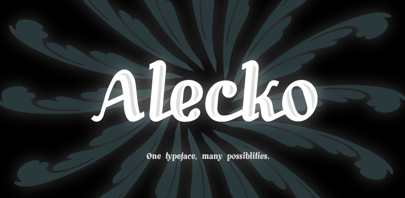
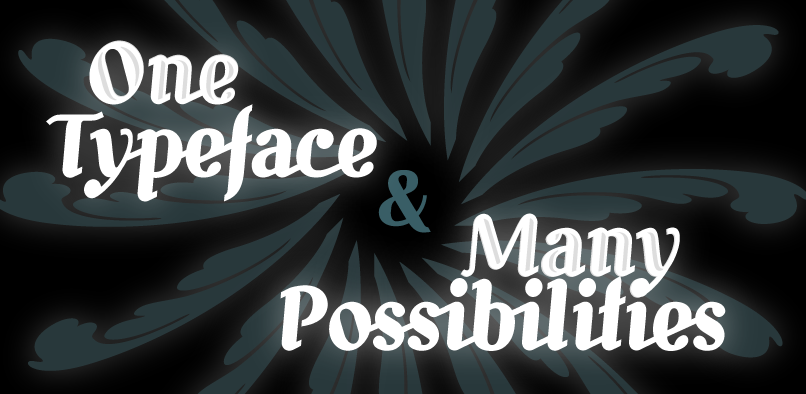
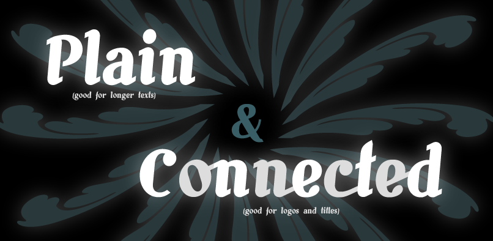
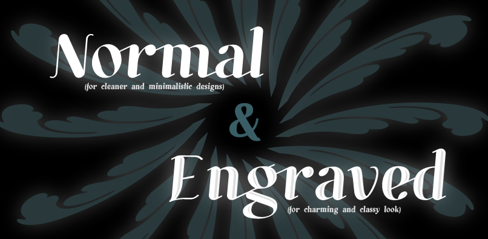

Alecko Typeface
===

Alecko is a distinctive didone-style typeface, which is strongly influenced by calligraphy, but is at the same time drawn with mathematical precision. Its advantages are summarized in its slogan: “One typeface, many possibilities”. Once you decide to use it, you can alter its look in a variety of ways: Should the contrast between the horizontal and vertical strokes of the glyphs be high or low? Is it appropriate to apply engraving to the letters (and what color?). Should the glyphs be connected to one another? 

Alecko is equipped with a lot of alternative characters, which are automatically inserted as you type, in order to achieve a “handwritten” look, however, it can also work without them

[Download](otf/)
